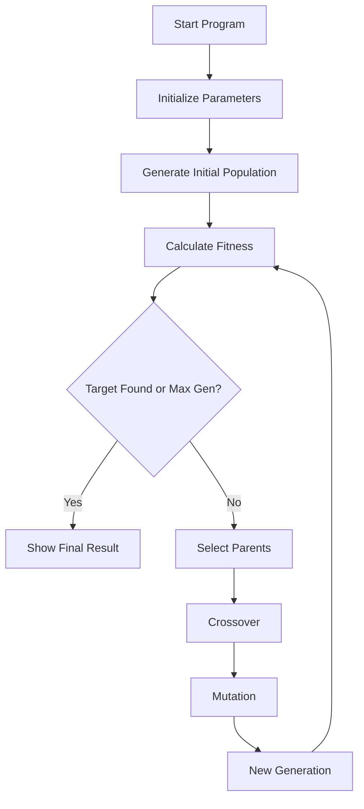

## 🧬 Genetic Text Evolution: Evolving "HELLO WORLD" with Python
- Welcome to Genetic Text Evolution, an interactive and visual demonstration of how a Genetic Algorithm (GA) can learn to evolve a random set of characters into a target phrase — in this case, the classic "HELLO WORLD".

- Built with tkinter and matplotlib, this project makes evolutionary computation fun, visual, and beginner-friendly.

## 📌 Features
- 🎯 Target Phrase Matching: Evolve random characters into any desired string.

- 🧠 Genetic Algorithm Logic: Includes selection, crossover, mutation, and fitness evaluation.

- 📊 Live Visualization: Track the best fitness score over generations using matplotlib.

- 🖱️ Interactive GUI: Modify parameters like population size and mutation rate via a user-friendly interface.

## 🖼️ Screenshot

## 🚀 How It Works

## ⚙️ Requirements
- Python 3.7+

- tkinter

- matplotlib

## 📘 Theory Reference
- Genetic Algorithms are inspired by Darwin’s theory of natural selection.

- This implementation is based on fitness-based evolution using crossover and mutation.
